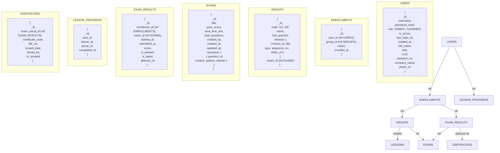

```mermaid
graph TD

    B[USERS] -->|ref| C[ENROLLMENTS]
    C -->|ref| D[GROUPS]
    D -->|embed| E[LESSONS]
    D -->|ref| F[EXAMS]
    C -->|ref| G[EXAM_RESULTS]
    G -->|optional ref| H[CERTIFICATES]
    B -->|ref| I[LESSON_PROGRESS]
    G[EXAM_RESULTS] -->|ref| F[EXAMS]
    %% Chi tiết từng collection (Document schema)

    subgraph USERS
      direction TB
      B_desc["{
        _id,
        username,
        password_hash,
        role: 'ADMIN' | 'LEARNER',
        is_active,
        last_login_at,
        created_at,
        full_name,
        dob,
        cccd,
        passport_no,
        company_name,
        photo_url
      }"]
    end

    subgraph ENROLLMENTS
      direction TB
      C_desc["{
        _id,
        user_id (ref USERS),
        group_id (ref GROUPS),
        status,
        enrolled_at
      }"]
    end

    subgraph GROUPS
      direction TB
      D_desc["{
        _id,
        code: 'G1..G6',
        name,
        has_practice,
        lessons: [
          { lesson_id, title, type, sequence_no, video_url }
        ],
        exam_id (ref EXAMS)
      }"]
    end

    subgraph EXAMS
      direction TB
      F_desc["{
        _id,
        title,
        pass_score,
        time_limit_min,
        total_questions,
        created_by,
        created_at,
        updated_at,
        questions: [
          { question_id, content, options, answer }
        ]
      }"]
    end

    subgraph EXAM_RESULTS
      direction TB
      G_desc["{
        _id,
        enrollment_id (ref ENROLLMENTS),
        exam_id (ref EXAMS),
        started_at,
        submitted_at,
        score,
        is_passed,
        is_latest,
        attempt_no
      }"]
    end

    subgraph LESSON_PROGRESS
      direction TB
      I_desc["{
        _id,
        user_id,
        lesson_id,
        group_id,
        completed_at
      }"]
    end

    subgraph CERTIFICATES
      direction TB
      H_desc["{
        _id,
        exam_result_id (ref EXAM_RESULTS),
        certificate_code,
        file_url,
        issued_date,
        issued_by,
        is_revoked
      }"]
    end

```
